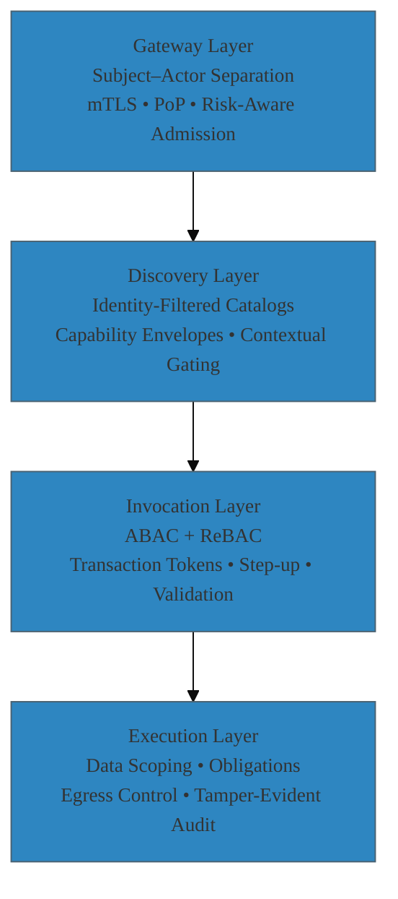

Identity Security for AI (MCP) Agents: A Four-Layer Continuous Authorization Model   

> “OAuth validates requests. Agents create sequences.  
> The gap between the two is where risk lives.”  

Most teams building with the Model Context Protocol treat it like a normal API: put OAuth in front, validate a token, move on. That won't work.  
OAuth can confirm that a caller is authenticated and has some permissions. What it can't do is prevent an autonomous agent from chaining multiple legitimate tools in a way that produces an unauthorized outcome. Each individual call might be allowed, but the combined action, the emergent behavior is outside what the system was designed to allow.  

MCP is the control plane for AI agents. These systems plan, chain tools, and follow paths you didn't design. Identity security here isn't a one-time check. It's continuous verification of who the human is, who the agent is, and exactly what each step is allowed to do.  

---

## What Changed  

- **Agent behavior is unpredictable.** They combine tools in ways you didn't plan for.  
- **Every request has multiple actors.** A human user and a non-human agent.  
- **Showing tools creates risk.** If an agent can see a tool, it becomes a target.  
- **Parameters matter more than endpoints.** The right tool with wrong data is a breach.  

---

## What to Build  

- Separate human and agent identity on every call.  
- Give agents and tools their own cryptographic identities with mutual TLS.  
- Filter what tools agents can see based on who's using them and return signed permission grants, not just API docs.  
- Create single-use tokens for each tool call that lock in the exact action and resource.  
- Control data access at the database level with field and row filtering that works even if upstream checks fail.  
- Add controls for memory access, background jobs, instant revocation, rate limits, and tool supply chain security.  

> If you can't answer "who is the subject, who is the actor, and what specific permission authorized this exact step," you don't have identity security for agents.  

---

## The Four-Layer Continuous Authorization Framework  



---

## 1) Gateway Layer  

Verify who's making requests and limit what they can do before anything else happens.  

- **Separate human and agent identity**. Send both the end user and the agent runtime on every call. Don't collapse them into one token.  
- **Give workloads their own identity.** Issue SPIFFE identities to every agent and tool. Require mutual TLS between all components.  
- **Bind tokens to TLS sessions.** Tie user tokens to the mTLS session or use DPoP. A stolen token is useless without the bound key.  
- **Use structured permission requests.** Use Rich Authorization Requests to specify exactly what you want to do, not generic scopes.  

---

## 2) Discovery Layer  

What tools an agent can see depends on who's using it. Don't show tools they can't use.  

- **Filter tool lists by identity.** Return only the tools the user is allowed to use given their current context and the agent's identity.  
- **Return signed permission grants.** Instead of plain API schemas, send back signed grants with built-in limits like resource filters, amount caps, expiration, and use counts.  
- **Hide risky tools until requirements are met.** Don't show high-risk tools until security requirements like step-up authentication or approvals are satisfied.  

---

## 3) Invocation Layer  

This is where permissions become real. Validate the action on the specific resource.  

- **Combine attribute and relationship-based access control.** Mix user attributes like role and approval limit with relationships like "manages" or "owns." Use a graph database like Zanzibar or OpenFGA.  
- **Create single-use tokens.** Generate short-lived tokens bound to the agent that encode exact intent. If any parameter changes, the call fails.  
- **Require step-up for high-risk actions.** Set thresholds on amount, data sensitivity, or anomaly scores that force stronger authentication or additional approval.  

---

## 4) Execution Layer  

The final check. Treat every tool like it handles sensitive data.  

- **Control data access at the row and column level.** Rewrite database queries server-side based on user permissions. Never trust filters that come from the model.  
- **Apply data handling rules.** The policy engine returns allow/deny plus specific instructions like "mask fields," "limit rows," or "redact attachments."  
- **Create tamper-proof audit logs.** Log user, agent, permission ID, request hash, decision inputs, and policy version. Sign logs or send to write-once storage.  

---

## How This Works: Expense Approval Example  

Goal: Approve invoice INV-8831 for Dept 42, amount $4,800.  

1. **Discovery:** The policy engine returns `approveExpense` only for Finance users who manage Dept 42. Response includes a signed permission grant with constraints.  
2. **Invocation:** Agent requests approval. Gateway swaps the user token for a transaction token tied to the agent and tool.  
3. **Execution:** Tool verifies all token details, applies data filtering, hides irrelevant fields, writes signed audit record.  
4. **Response Filtering:** Response filtered again. Only minimal fields return to agent.  

If amount exceeds $5K, the system blocks and requires step-up authentication and co-approver consent.  

---

```json
{
  "iss": "mcp-gateway",
  "sub": "user:alice",
  "actor": "spiffe://prod/agents/planner-42",
  "aud": "spiffe://prod/tools/expense",
  "cap": {
    "tool": "approveExpense",
    "dept": "42",
    "invoiceId": "INV-8831",
    "amount_max": 5000,
    "uses": 1
  },
  "cnf": { "mtls": true },
  "exp": 1736284800,
  "jti": "e3d1b4f2-4d1c-4f7a-9b8a-7c9f9a0a0c1a"
}
```

---

## Implementation Reality  

**Adoption Path**  

1. **Start with workload identity.** SPIFFE for agents and tools with mutual TLS.  
2. **Add dual identity tracking.** Separate human and agent identity in tokens and logs.  
3. **Set up a shared policy engine.** ABAC engine plus relationship graph. Start with one critical tool.  
4. **Control discovery.** Return signed permission grants, not static API docs.  
5. **Add transaction tokens.** Short-lived, single-use, intent-specific at invocation.  
6. **Push data controls down.** Row and field policies in handlers and databases.  
7. **Extend everywhere.** Memory, background jobs, response filtering with same policy engine.  
8. **Wire instant revocation.** Policy versioning enables immediate capability shutdowns.  

**What This Actually Takes**  
- **2–3 sprint investment** for foundational SPIFFE and policy engine infrastructure.  
- **Per-tool migration effort** of 1–2 weeks each for discovery and execution controls.  
- **New operational overhead** for policy management, key rotation, audit analysis.  
- **Team training** on ABAC/ReBAC policy languages and transaction token patterns.  

The complexity is real. The alternative is hoping emergent agent behaviors stay within bounds you never defined.

---

## Reference Architectures  

**Identity Model**  
- **Subject**: human end user from your identity provider.  
- **Actor**: agent planner or worker process.  
- **Tool service**: MCP handler or downstream API.  
- **Data stores**: databases, vector stores, object storage.  

**Cedar Policy Example**  
```cedar
permit(
  principal in FinanceManager,
  action == Approve,
  resource in Expense
)
when {
  principal.manages.contains(resource.dept)
  && resource.amount <= principal.approvalLimit
  && context.intent == "approveExpense"
  && context.actor == "spiffe://prod/agents/planner-42"
};
```

**OpenFGA Relationships**  
```cedar
user:alice#manages@dept:42
user:bob#co_approver_for@dept:42
expense:INV-8831#in_dept@dept:42
```

---

## Threat Model and Controls  

- **Confused deputy**: Agent uses its own privileges rather than the user's → Subject–actor separation, PoP-bound tokens.  
- **Tool injection**: Prompts push agent to hidden tools → Identity-filtered discovery, sanitized descriptors, planner gating.  
- **Parameter abuse**: Valid tool, wrong resource → ABAC + ReBAC, transaction tokens.  
- **Data oversharing**: Extra rows or fields returned → Row/field policies, obligations, egress filtering.  
- **Token exfiltration**: Bearer token in logs or memory → mTLS/DPoP binding, short TTLs.  
- **Stale background power**: Jobs run after role change → Fresh auth at job start, graph re-check, centralized revocation.  
- **Supply chain compromise**: Malicious or outdated handler → Signed artifacts, SBOMs, discovery gates tied to attestation.  

---

## Essential Observability  

- **Decision logs**: User, agent, permission ID, request hash, policy inputs, policy version, rules applied.  
- **Chain of custody**: Single trace ID connecting discovery → invocation → execution → response.  
- **Revocation evidence**: Policy versions in every decision to instantly invalidate cached grants.  
- I**dentity verification**: SPIFFE issuance and tool signature verification with timestamps.  

---

## Leader Checklist  

- Can you trace every agent action to a human user, workload identity, and specific permission?  
- Can you revoke permission types system-wide by updating one policy version?  
- Are tool catalogs filtered by identity with signed descriptors, not static JSON?  
- Do memory and retrieval use the same policy engine as execution?  
- Can you prove which SPIFFE-identified runtime executed each sensitive step?  

---

## Architecture Playbook  

- **Identity**: SPIFFE for all components, mTLS everywhere.  
- **Authorization**: OAuth with Rich Authorization Requests, token exchange, proof-of-possession.  
- **Policy engines**: Cedar/OPA for attributes, OpenFGA/Zanzibar for relationships.  
- **Transaction tokens**: Tool-specific, resource-filtered, time-bounded, agent-verified.  
- **Data controls:** Server-side rewriting, policy engine obligations, response filtering.  

---

**Continuous authorization** is the only way to secure unpredictable agent systems. When every step traces to a verified user, authenticated agent, and signed permission, autonomous systems can move fast while staying within bounds. Everything else is security theater.  

---
