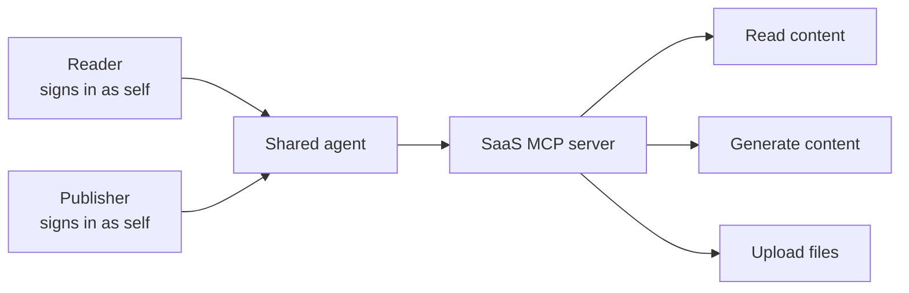
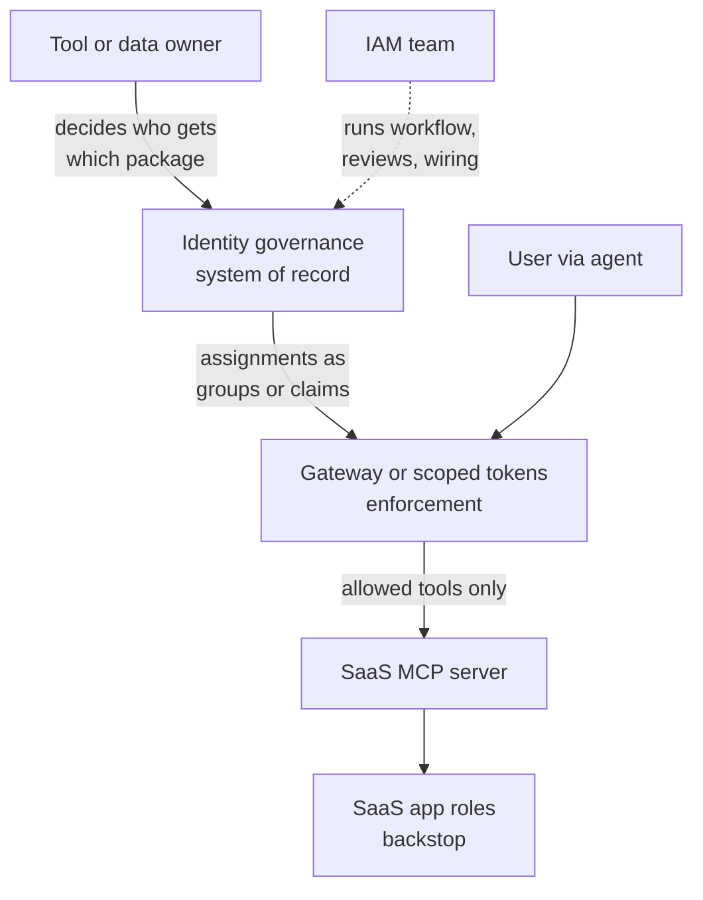

A common request is showing up in security teams right now. A business team wants their SaaS tool available inside the company's AI assistant. The vendor has an MCP server. The team wants it connected.

The first question in the review is usually authentication. Does the connector use OAuth or an API key? Does each user sign in as themselves, or does everyone share the builder's credentials?

That question matters. It's also where most reviews stop. And it leaves a second question unanswered.

## What this article covers

This piece is about one specific setup: an AI agent that a person uses directly, acting on that person's behalf through delegated access to a SaaS tool.

It does not cover autonomous agents running with their own identity. That's a different problem.

It also covers access at the tool level only. Which tools can a person use through the agent? Controlling what those tools can touch, such as which records or which parameters, is a deeper layer. I wrote about that in an earlier piece on continuous authorization for MCP. This article addresses the layer before it.

## Delegated login answers one question

When the connector uses per-user OAuth and the user's own credentials, the SaaS app sees the actual person. Actions are attributed correctly. When someone leaves, disabling them in the identity provider can cut off the agent's access too, but only if revocation reaches the SaaS app or MCP service. If revocation doesn't propagate, a long-lived refresh token keeps working until it expires.

That's the right baseline. But it answers "who is this person." It doesn't answer "which tools should this person be able to use through the agent."

In most agent platforms today, tools are enabled per agent, not per user. Everyone who can use the agent gets the same tool list. A person who only needs to read reference content gets the same generate and upload tools as a person who publishes.

*Both users are identified correctly. Both get the same three tools.*

## Agents make existing access easier to use

Agents don't create new entitlements. The user already holds whatever permissions they hold in the SaaS app.

What agents change is the effort required to use that access. A permission a person never uses, because it's buried three menus deep, carries little practical risk. Behind an agent, the same permission is one sentence away.

So existing over-provisioning carries more risk than it did before. Nothing about the entitlement changed. The cost of using it did.

A persisted delegated grant can create a new access path, including one the agent can use when the person is not present, but the underlying entitlement is still the user's.

## The obvious fixes, and where each one stops

*Rely on the SaaS app's own roles.* The user's identity reaches the app, so the app's permissions apply. This works only if those roles are accurate. Most organizations know their SaaS roles are not.

*Build a separate agent for each role.* A read-only agent for one group, a full agent for another. This works on day one. It doesn't scale. The number of agents grows with use cases multiplied by roles, and someone has to maintain all of them.

*Put a gateway in front of the MCP server.* The gateway reads the user's identity and filters which tools they can see and call. This is the right enforcement pattern. But a gateway evaluates rules. It doesn't decide who should hold which tool. Someone still has to author that assignment, approve it, review it, and remove it.

*Use OAuth scopes per tool.* Scopes are defined by the app that serves the tools, not by your identity provider. If the vendor doesn't define a scope per tool, and most SaaS MCP servers don't today, there's nothing to assign. You can't govern at a granularity the vendor didn't build. Even when it does, the mapping of people to scopes still has to come from somewhere governed.

Each option reduces to the same question: where is tool-level access defined, and who owns it?

## Tools are entitlements. Govern them like entitlements.

The answer is to treat each tool, or group of tools, as an entitlement. It gets requested, approved, reviewed, and revoked like any other access.

In practice that splits into three parts:

**System of record: identity governance.** This is where assignments are defined and reviewed. It is not in the request path and does not make runtime decisions.

**Enforcement: a gateway or scoped tokens.** This reads the assignment at runtime and allows or blocks the call.

**Backstop: the SaaS app's own roles.** These still apply, and they still need normal access reviews.

Bundling tools by use case keeps this manageable. "Content drafting" and "publishing" become access packages. Users get packages. The organization runs one agent, not one per role.

Bundling access isn't new. What's new is the unit. The entitlement is the tool, not the application.

The tool or data owner decides which packages people need. IAM owns the machinery: the entitlement model, request and approval workflow, review cadence, and enforcement wiring. IAM should not invent the business assignment.

*Owners decide. IAM runs the process. The gateway enforces. App roles catch what's left.*

## What this doesn't solve

Tool-level governance limits which actions a person can take through an agent. It doesn't limit what those actions can reach. A permitted tool called with the wrong parameters is still a problem.

It also doesn't give the agent its own identity. The SaaS app sees the human, not the agent acting for them. Carrying both through every hop is where this needs to go. Few SaaS MCP servers support that today.

It also assumes tool owners will define and maintain assignments. Anyone who has run access reviews knows that's the hard part. Adding tool-level entitlements makes that job bigger, not smaller. That's a topic for its own piece.

## Questions worth asking

Of your agent platform: Can tool access vary by user, or only by agent?

Of your gateway: Where does it get the assignments it enforces?

Of your identity governance platform: Can it model individual agent tools as entitlements, with requests, approvals, and reviews? Or only application access for people?

Of your SaaS vendor: Do you define scopes per tool, and how quickly do you honor token revocation?

Of your own review process: When a team asks to connect a tool, does the review stop at authentication?

We've made good progress on enforcing tool access for agents. The governance side still needs an owner. IAM should build and run the process. The people who own the tools and the data should decide who gets what. That's how the rest of access governance already works. Agent tools shouldn't be the exception.
