If you missed my last post on what makes something an identity, start there — it sets the groundwork. This piece goes deeper: how to architect identity as the control plane for enterprises running cloud workloads and autonomous agents.

This isn’t theory. It’s about production identity architectures that handle millions of authentications, thousands of microservices, and the new security challenges of AI agents.

Whether you’re securing traditional enterprise apps, cloud-native services, or agent-driven workflows, the patterns here offer a roadmap — from where most organizations are today to where identity is heading.

---

## Foundation: The Identity Architecture Stack

Modern identity architecture operates as a multi-layered control plane that orchestrates authentication and authorization across all identity types.

```mermaid
graph TD
    A["🧩 Identity Provider<br>(Authentication / IdP)"] --> B["🔐 Credential Management<br>(Keys · Certs · Tokens · Secrets)"]
    B --> C["⚙️ Runtime Binding<br>(Workloads · Devices · Agents)"]
    C --> D["🧠 Policy Decision Engine<br>(Authorization · Risk · Control)"]
    D -->|Continuous Verification 🔁| A

    style A fill:#2563eb,stroke:#1e3a8a,stroke-width:3px,color:#f9fafb
    style B fill:#059669,stroke:#064e3b,stroke-width:3px,color:#f9fafb
    style C fill:#d97706,stroke:#92400e,stroke-width:3px,color:#f9fafb
    style D fill:#dc2626,stroke:#7f1d1d,stroke-width:3px,color:#f9fafb

    linkStyle 0,1,2,3 stroke:#6366f1,stroke-width:2px
```



Each layer has specific responsibilities, and the architecture you choose depends on your identity mix: primarily human, heavily cloud-native, AI agent-driven, or hybrid.

---

## Traditional Enterprise Identity Architecture

The first stop is what most enterprises already have: traditional IAM.

### Core Components and Patterns

**Identity Provider Layer (Azure AD, Okta, Ping Identity)**
Centralized authentication for all human users
Integration with HR systems for automated lifecycle management
Risk-based conditional access policies

**Directory Services (Active Directory, LDAP)**
Authoritative source for users, groups, and organizational hierarchy
Group-based authorization model
Integration with on-premises applications and services

**Privileged Access Management**
Just-in-time access for administrative accounts
Session recording and approval workflows
Credential vaulting for service accounts

### Architecture Strengths
- Mature ecosystem with extensive application integrations
- Strong compliance and audit capabilities
- Well-established identity lifecycle management
- Battle-tested at enterprise scale

### Limitations for Modern Workloads
- Primarily designed for human-to-application access patterns
- Limited support for dynamic, ephemeral identities
- Coarse-grained authorization (group-based vs. attribute-based)
- Struggles with microservices-scale authentication requirements

---

## Cloud-Native Identity Architecture

But as workloads shifted to cloud, these human-centric systems hit limits. Enter cloud-native identity.

### Workload Identity Patterns

**AWS Pattern: IAM Roles + STS Tokens**
EKS pods assume IAM roles via OIDC provider
Short-lived tokens (15 minutes to 12 hours)
No API keys stored in containers

**Google Cloud Pattern: Workload Identity Federation**
Kubernetes ServiceAccounts mapped to Google Service Accounts
OAuth 2.0 tokens from metadata service
Cryptographic attestation of runtime environment

**Azure Pattern: Managed Identities**
System or user-assigned identities for Azure resources
Azure AD tokens via instance metadata
Eliminates credential management entirely

### SPIFFE: Universal Workload Identity

SPIFFE (Secure Production Identity Framework for Everyone) provides cryptographically verifiable workload identity across platforms.

**Core Concepts:**
SPIFFE ID: URI-based identity (spiffe://trust-domain/workload/service-name)
SVID: Short-lived X.509 certificate (1-24 hours)
Workload API: Automatic credential rotation
Trust bundles: Cross-domain verification

Example SPIFFE Identity:
```
Subject: spiffe://prod.company.com/workload/payment-processor
Validity: 1 hour (automatic rotation)
Attestation: Kubernetes pod with specific ServiceAccount
```
Service Mesh Integration: SPIFFE integrates with Istio, Linkerd, and Consul Connect for automatic mTLS between services, eliminating the need for application-level certificate management.

---

## Federated Identity Architecture

Cloud introduced new complexity: multiple platforms, SaaS providers, and external partners. Federation became essential for trust across boundaries.

### Cross-Domain Trust Patterns

**Human Federation (SAML/OIDC):**
Corporate identity provider federates with SaaS applications
Single sign-on without credential duplication
Attribute release policies control what information is shared

**Workload Federation:**
Cross-cloud identity (GCP workload accessing AWS resources)
GitHub Actions assuming cloud roles
CI/CD pipelines with temporary credentials

### Key Federation Principles
1. Trust Establishment: Cryptographic verification of federation partners
2. Attribute Mapping: Consistent identity attributes across domains
3. Policy Synchronization: Coordinated access policies between systems
4. Audit Correlation: Unified logging across federated systems

---

## Zero Trust Identity Architecture

Federation solves cross-domain trust, but it doesn’t solve continuous verification inside those domains. That’s where Zero Trust comes in.

### Continuous Verification Principles

Zero trust fundamentally changes identity from "authenticate once, trust everywhere" to "never trust, always verify."

That means identity isn’t just checked at login — it’s continuously evaluated.

To make this work, Zero Trust uses three roles:

1. **Policy Administration Point (PAP):** Where policies are authored and managed.
2. **Policy Decision Point (PDP):** The brain — evaluates each request against policy and risk.
3. **Policy Enforcement Point (PEP):** The guard — intercepts requests and enforces the decision.

Together, these points create a continuous identity control loop:

PAP defines rules, PDP makes decisions in real time, PEP enforces them at every access attempt.

Then you can naturally expand into contextual risk factors, ABAC/ReBAC, microsegmentation, etc.

### Microsegmentation Implementation

**Network-Level:** Software-defined perimeters around individual workloads
**Application-Level:** API-level authorization for every service call
**Data-Level:** Row and column-level access controls in databases

---

## AI Agent Identity Architecture: The 4-Layer Framework

Zero Trust fixed “authenticate once, trust everywhere.” But AI agents break even Zero Trust, because they can chain valid actions into invalid outcomes. That demands a new framework.

AI agents present unique identity challenges because they can autonomously chain multiple legitimate tools in ways that produce unauthorized outcomes. Traditional "authenticate once, authorize everywhere" patterns fail when agents can dynamically compose actions.

### The Core Problem

Traditional OAuth validation:
✅ Agent has "expense:approve" permission
❌ Can't prevent: approve(someone_else's_invoice, amount: $999,999)

Each individual call looks legitimate, but the sequence is unauthorized.

This requires continuous authorization where every tool invocation is independently verified.

### Layer 1: Broker - Identity Separation and Request Validation

Dual Identity Tracking:
- Human subject: user:alice
- Agent actor: spiffe://prod/agents/expense-assistant
Every request carries both identities

Cryptographic Binding:
- Agents get SPIFFE identities with mTLS
- Tokens bound to TLS sessions (DPoP)
- Stolen tokens are useless without cryptographic keys

Structured Permission Requests:
- Rich Authorization Requests (RFC 9396)
- Specify exact intent, not generic scopes
- Enable fine-grained policy decisions

### Layer 2: Discovery - Contextual Tool Visibility

Key Principle: What tools an agent can see depends on who's using it.

Dynamic Tool Catalogs:
- Filter available tools based on user + agent identity
- Return signed permission grants, not static API docs
- Hide risky tools until security requirements are met

Permission Grant Example:
```
{
  "tool": "approveExpense",
  "constraints": {
    "amount_max": 5000,
    "department": "42",
    "requires_mfa": true
  },
  "expires": "2024-09-15T11:00:00Z",
  "signature": "eyJ0eXAiOiJKV1QiLCJhbGci..."
}
```

### Layer 3: Invocation - Transaction Tokens and Intent Verification

Transaction Token Exchange:
- Agent exchanges general token for action-specific token
- Token encodes exact intent (invoice ID, amount, department)
- Single-use, short-lived (5 minutes), parameter-locked

Step-Up Authentication:
- Amount > $5K: Require MFA
- Amount > $10K: Require dual approval
- Risk score > 80: Require manager approval
- Anomalous pattern: Require security review

### Layer 4: Execution - Data Controls and Audit

Database-Level Controls:
- Row-level security based on user permissions
- Column-level masking for sensitive data
- Server-side query rewriting (never trust client filters)

Tamper-Proof Audit:
- Every decision logged with cryptographic hash
- Immutable audit trail (blockchain or write-once storage)
- Policy version tracking for instant revocation

### Implementation Example: Expense Approval

Flow:
1. Discovery: Policy engine returns approveExpense tool only for Finance managers of Dept 42
2. Invocation: Agent requests approval for INV-8831 ($4,800)
3. Validation: System checks amount < user's limit, verifies department ownership
4. Execution: Database applies row filtering, masks irrelevant fields, logs decision
5. Response: Returns minimal success/failure data to agent

If amount > $5K: System blocks and requires step-up MFA + manager approval.

---

## Identity Control Plane: Orchestrating It All

Once humans, workloads, and agents all have identities, you need an identity control plane to orchestrate it all — and prepare for what’s next.

### Core Functions

1. **Identity Lifecycle Management:** Automated provisioning from authoritative sources, policy-driven access assignment, continuous compliance monitoring, and automated deprovisioning.
2. **Credential Management:** Automatic key rotation, HSM integration, secure secret distribution, and emergency revocation.
3. **Policy Administration:** Centralized authoring, real-time policy distribution, versioning, A/B testing, and rollback.
4. **Observability and Analytics:** Real-time authentication monitoring, anomaly detection, access reviews, and compliance reporting.

### Token Lifecycle Patterns

**Short-Lived Tokens (15-60 minutes):**
Minimize blast radius if compromised.
Enable just-in-time access patterns.
Reduce key rotation complexity.

**Automatic Renewal:**
Background token refresh before expiration.
No service interruption during rotation.
Cryptographic binding prevents reuse.

### Security Architecture Patterns

**Defense in Depth for Identity**
1. Preventive Controls: MFA, least privilege, segmentation, input validation.
2. Detective Controls: Monitoring, analytics, auditing, threat intelligence.
3. Responsive Controls: Incident response, dynamic policy changes, emergency revocation, and forensics.

### Credential Strength Hierarchy
1. Zero-knowledge proofs
2. Ephemeral workload identity (SPIFFE)
3. Hardware-backed certificates
4. Verifiable credentials
5. Short-lived bearer tokens
6. Long-lived API keys

### Critical Anti-Patterns
**Traditional Systems:** Shared accounts, over-privileged roles, long-lived secrets, config-stored credentials, missing runtime attestation.
**AI Agent Systems:** Treating agents as service accounts, missing continuous authorization, static grants, no separation of identity, poor audit trails.

---

## The Future of Identity Architecture

Identity has moved from passwords to workloads to agents — and it won’t stop there.

### Emerging Patterns
- **AI-Native Identity:** Specialized protocols for agent-to-agent authentication.
- **Privacy-Preserving Identity:** Zero-knowledge proofs and selective disclosure.

### Architectural Evolution
- **Perimeter → Identity:** Identity is the new security boundary.
- **Static → Dynamic:** Context-aware, risk-based policies.
- **Human → Multi-Modal:** Unified handling of humans, workloads, and agents.

### Key Takeaways
1. Start with strong foundations — SPIFFE-based workload identity and centralized policy.
2. Separate identity types for humans, services, and agents.
3. Embrace continuous authorization for AI workflows.
4. Plan for scale and observability.
5. Layer preventive, detective, and responsive controls.

Identity isn’t just authentication anymore — it’s the control plane for modern digital business.
